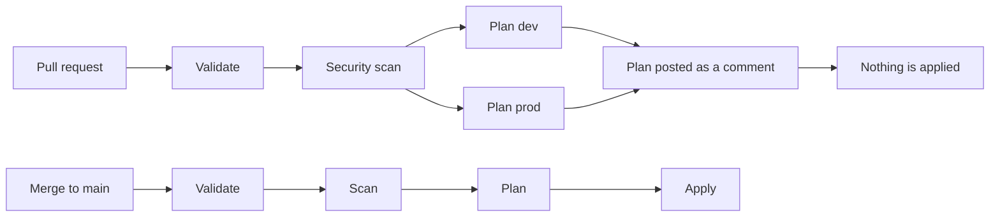

# gcp-baseline

An opinionated network baseline for a Google Cloud project, managed end to end by
Terraform: planned on every pull request, applied on merge, and checked for drift
on a schedule.


This repository exists to demonstrate **infrastructure as code**, not clever
networking. The interesting parts are [`modules/network`](modules/network) and
[`.github/workflows/terraform.yml`](.github/workflows/terraform.yml).

---

## What it builds

- A **custom-mode VPC** — no auto subnets, and none of the default firewall rules
  that open SSH and RDP to the whole internet.
- **Subnets** declared as a map, so adding one is a two-line change.
- **SSH only through IAP.** There is no `0.0.0.0/0` ingress rule anywhere, and the
  pipeline refuses one.
- **Egress denied by default**, with an explicit allow for Google APIs. GCP allows
  all outbound traffic unless you say otherwise.
- **Cloud NAT behind a switch**, off by default, because it is billed per hour with
  no free allowance.

## How a change reaches the cloud



Nobody runs `terraform apply` from a laptop. The pipeline authenticates with
**Workload Identity Federation** — there is no service account key in this
repository, in GitHub, or anywhere else.

## Design decisions

### Environments are directories, not workspaces

`environments/dev` and `environments/prod` each have their own backend prefix and
their own state. The environment is part of the path, so it appears in the
command, in the diff, and in the pipeline configuration.

Terraform workspaces would put both states in one place and make the current
environment invisible — it would live in a file inside `.terraform/` on whoever's
machine is running. A diff would look identical whether it targeted dev or prod.

### The bootstrap is applied by hand

`bootstrap/` creates the state bucket and the identity the pipeline uses. It
cannot be applied by the pipeline, because the pipeline needs both to exist first.
It is applied once from Cloud Shell, and its own state is then migrated into the
bucket it just created.

### `for_each` for subnets, `count` for the NAT

Subnets are keyed by name, so removing one removes exactly one. With `count` and a
list, deleting the middle entry shifts every index after it and Terraform destroys
and recreates resources nobody touched.

`count` is used exactly once, for Cloud NAT, where the question is "does this exist
or not" and there is no list to shift.

### The saved plan is what gets applied

`terraform plan -out=tfplan` produces a file; the apply job consumes that file.
If the state moved between the two, Terraform refuses to apply it rather than
doing something nobody reviewed.

### Everything is version-pinned

Terraform, the Google provider, checkov, and the actions. A version change has to
be a commit, with an author and a reviewer — not something that happens on a
Tuesday because an upstream tag moved.

## Known limitations

- **The service account has `roles/compute.networkAdmin`**, which is broader than
  this repository needs. A custom role with the exact permission list would be
  correct; it is not done here, and it is the first thing to fix.
- **The module is referenced by a local path**, so it has no version. Adding a
  field to it changes both environments on their next apply. Versioning only
  becomes possible when the module moves to a repository of its own.
- **The plan reviewed on the pull request is not the plan applied on merge** if
  another PR landed in between. The apply consumes a plan produced in its own run;
  a stale one is refused rather than silently re-planned.
- **No `prevent_destroy` on the VPC.** The state bucket has it; the network does
  not, because during development it is destroyed and recreated on purpose.
- **This runs in a free-trial project with no organisation.** Organization
  policies — the layer that would stop a default network from ever being created —
  need one, and a personal account does not have one.
- **Scheduled workflows switch themselves off** after 60 days without repository
  activity in a public repository. The drift check would stop silently.

## Running it yourself

You need a GCP project and a GitHub account.

```bash
# once, from your own shell
gcloud auth login
gcloud auth application-default login        # Terraform reads these, not gcloud's own
gcloud config set project YOUR-PROJECT-ID

gcloud services enable serviceusage.googleapis.com cloudresourcemanager.googleapis.com
cd bootstrap && terraform init && terraform apply

# then add backend.tf with the bucket name it printed, and:
terraform init -migrate-state
```

Copy the three outputs into GitHub repository **variables** (not secrets — none of
them is one): `GCP_PROJECT_ID`, `WIF_PROVIDER`, `CI_SERVICE_ACCOUNT`.

## Layout