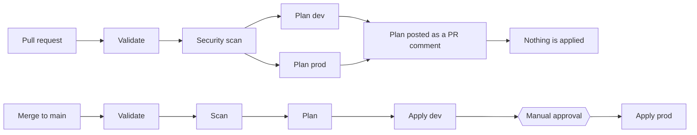

# gcp-baseline

An opinionated network baseline for a Google Cloud project, managed end to end by
Terraform: planned on every pull request, applied on merge, protected by branch
rules, and checked for drift on a schedule.


This repository exists to demonstrate **infrastructure as code as an operating
practice**, not clever networking. The interesting parts are
[`modules/network`](modules/network) and
[`.github/workflows/`](.github/workflows).

The question it answers that a "look, Terraform" repository does not:
**what happens when somebody changes things without going through here?**

---

## What it builds

- A **custom-mode VPC** — no auto subnets, and none of the default firewall rules
  that open SSH and RDP to the whole internet.
- **Subnets** declared as a map, so adding one is a two-line change.
- **SSH only through IAP** (`35.235.240.0/20`). There is no `0.0.0.0/0` ingress
  rule anywhere, and the pipeline refuses one — see [Proof](#proof).
- **Egress denied by default**, with an explicit allow for Google APIs via
  `private.googleapis.com` (`199.36.153.8/30`). GCP allows all outbound traffic
  unless you say otherwise.
- **Cloud NAT behind a switch**, off by default, because it is billed per hour
  with no free allowance.

## How a change reaches the cloud



Nobody runs `terraform apply` from a laptop. The pipeline authenticates with
**Workload Identity Federation** — there is no service account key in this
repository, in GitHub, or anywhere else. The trust condition pins both the owner
and the repository name:

```hcl
attribute_condition = "assertion.repository_owner == \"...\" && assertion.repository == \"...\""
```

## What stops a bad change

| Control | Where it runs | Does it warn, or does it stop you? |
|---|---|---|
| `terraform fmt` pre-commit hook | your machine | **warns** — `git commit --no-verify` skips it |
| `Validate` | CI | **stops** — required status check |
| `Security scan` (checkov) | CI | **stops** — required status check |
| `Plan (dev)` / `Plan (prod)` | CI | **stops** — required status check |
| Branch ruleset on `main` | GitHub | **stops** — bypass list is empty, including the repository owner |
| Manual approval on `prod` | GitHub environment | **stops** — `Apply (prod)` waits for a human |
| `github.ref` guard on `Apply` | CI | **stops** — a manual run on any branch other than `main` skips the apply |
| Scheduled drift detection | CI | **reports** — opens an issue; it never applies anything |

## <a name="proof"></a>Proof

These are the checks that were actually exercised, not just configured:

- A pull request setting `source_ranges = ["0.0.0.0/0"]` on the IAP rule:
  `Validate` green, `Plan` green, **`Security scan` red, merge button greyed out**.
  A dangerous rule is still syntactically valid code — only the scan catches it.
- A firewall description changed by hand in the console: the scheduled drift job
  went **red for `dev` and green for `prod`**, and opened an issue containing the
  plan. Nobody pushed anything.
- `workflow_dispatch` on a feature branch: everything ran, **`Apply` was skipped**.
- The `moved` block: the same rename produced `1 to add, 1 to destroy` without it
  and `0 to add, 0 to change, 0 to destroy` with it.

## Design decisions

### Environments are directories, not workspaces

`environments/dev` and `environments/prod` each have their own backend prefix and
their own state. The environment is part of the path, so it appears in the
command, in the diff, and in the pipeline configuration.

Terraform workspaces would put both states in one place and make the current
environment invisible — it would live in a file inside `.terraform/` on whoever's
machine is running. A diff would look identical whether it targeted dev or prod.

### The bootstrap is applied by hand

`bootstrap/` creates the state bucket and the identity the pipeline uses. It
cannot be applied by the pipeline, because the pipeline needs both to exist
first. It is applied once from a local shell, and its own state is then migrated
into the bucket it just created.

### `for_each` for subnets, `count` for the NAT

Subnets are keyed by name, so removing one removes exactly one. With `count` and
a list, deleting the middle entry shifts every index after it and Terraform
destroys and recreates resources nobody touched.

`count` is used exactly once, for Cloud NAT, where the question is "does this
exist or not" and there is no list to shift.

### The saved plan is what gets applied

`terraform plan -out=tfplan` produces a file; the apply job consumes that file.
If the state moved between the two, Terraform refuses to apply it rather than
doing something nobody reviewed.

### Renames go through `moved`

A resource has two names: the block label, which exists only in the code and the
state, and `name`, which is what Google knows. `moved` reconciles the first
without touching the second — which is what makes tidying up code safe.

### Everything is version-pinned

Terraform, the Google provider, checkov, and the actions. A version change has to
be a commit, with an author and a reviewer — not something that happens on a
Tuesday because an upstream tag moved.

## Known limitations

- **The CI service account holds `roles/compute.networkAdmin` and
  `roles/compute.securityAdmin`**, both broader than this repository needs.
  `networkAdmin` alone grants read-only access to firewall rules, which is why
  the second one is there. A custom role with the exact permission list is the
  correct answer; it is not done here, and it is the first thing to fix.
- **A subnet's map key cannot be renamed.** The module builds the real name as
  `"${local.prefix}-${each.key}"`, so the key is part of the resource's identity
  in GCP, not just a label. A `moved` block would relocate it in the state and
  Terraform would still replace the subnet, because `name` forces replacement.
  Carrying an explicit `name` in the map would fix this.
- **The module is referenced by a local path**, so it has no version. Adding a
  field to it changes both environments on their next apply. Versioning only
  becomes possible when the module moves to a repository of its own.
- **The plan reviewed on the pull request is not the plan applied on merge** if
  another PR landed in between. The apply consumes a plan produced in its own
  run; a stale one is refused rather than silently re-planned.
- **No `prevent_destroy` on the VPC.** The state bucket has it; the network does
  not, because during development it is destroyed and recreated on purpose.
- **Two checkov findings are suppressed, with the reason written in the code.**
  `CKV_GCP_62` on the access-log bucket (pointing it at itself would recurse) and
  `CKV_GCP_125`, whose rule requires `assertion.sub ==` with a single claim value
  — that would pin one git ref and reject pull-request runs. The condition used
  here is narrower in practice; the rule disagrees with the shape, not the scope.
- **This runs in a free-trial project with no organisation.** Organization
  policies — the layer that would stop a default network from ever being created
  — need one, and a personal account does not have one.
- **Scheduled workflows switch themselves off** after 60 days without repository
  activity in a public repository. The drift check would stop silently.

## Running it yourself

You need a GCP project and a GitHub account.

```bash
gcloud auth login
gcloud auth application-default login        # Terraform reads these, not gcloud's own
gcloud config set project YOUR-PROJECT-ID

gcloud services enable serviceusage.googleapis.com cloudresourcemanager.googleapis.com
cd bootstrap && terraform init && terraform apply

# then add backend.tf with the bucket name it printed, and:
terraform init -migrate-state
```

Copy the three outputs into GitHub repository **variables** (not secrets — none
of them is one): `GCP_PROJECT_ID`, `WIF_PROVIDER`, `CI_SERVICE_ACCOUNT`.

### Enable the pre-commit hook

Git only runs hooks from `.git/hooks/`, and `.git/` is never committed. The hook
is versioned; activating it is a local step each clone has to do once:

```bash
ln -sf ../../scripts/hooks/pre-commit .git/hooks/pre-commit
```

It refuses a commit whose staged `.tf` files are not formatted, and tells you the
command that fixes it. It is a convenience, not a control — `Validate` in CI is
what actually enforces formatting.

### Healing drift

Drift has two correct answers, and choosing is the work:

- **Reality is wrong** → re-apply the committed configuration:
  **Actions → Terraform → Run workflow**, on `main`. The `Apply` job is guarded by
  `github.ref`, so a manual run from any other branch plans but does not apply.
- **The code is wrong** — somebody made a legitimate change under pressure and the
  repository never learned about it → bring the change into the code and open a
  pull request.

## Layout

```
bootstrap/              state bucket + Workload Identity Federation, applied by hand
modules/network/        the VPC, subnets, firewall rules and optional NAT
environments/dev/       calls the module with dev values and its own state
environments/prod/      the same, with prod values
scripts/hooks/          the pre-commit hook (activate it manually, see above)
.github/workflows/      validate -> scan -> plan -> apply, and scheduled drift
```